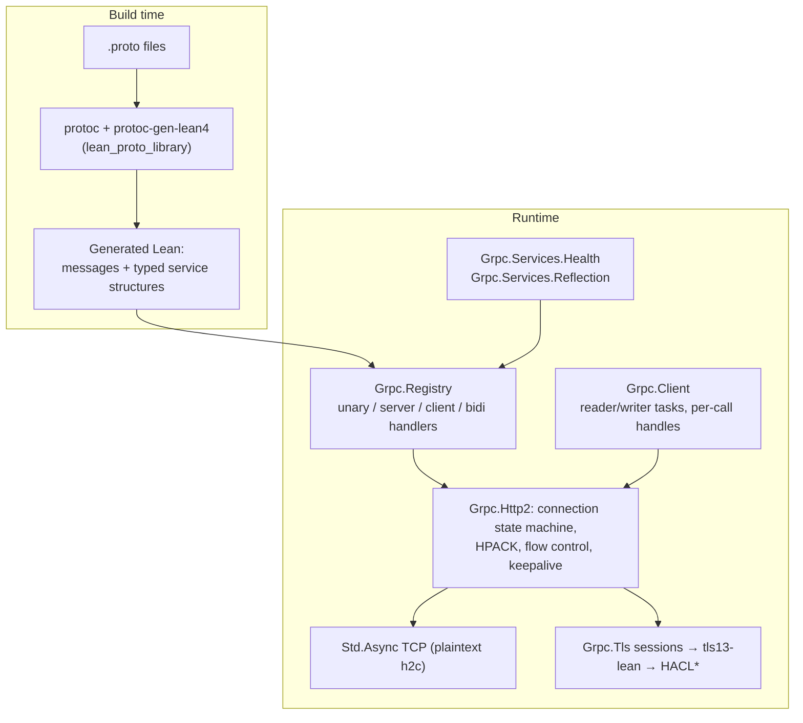

# grpc-lean

[](https://github.com/pb64-lean/grpc-lean/actions/workflows/ci.yml) [](https://github.com/pb64-lean/grpc-lean/actions/workflows/assurance.yml)

Protocol Buffers and gRPC for Lean 4: a pure-Lean gRPC client/server runtime
over HTTP/2, protobuf codegen wired into Bazel, TLS 1.3 termination via the
sibling [`tls13-lean`](https://github.com/pb64-lean/tls13-lean), and health +
reflection services. The Bazel module is named **`rules_lean_grpc`**.

The protocol stack — HTTP/2 framing, HPACK, flow control, gRPC message
framing, metadata, deadlines, cancellation — is implemented in Lean. The only
C in this repository is a small zlib shim for gzip message compression; TLS
cryptography is HACL\* via `tls13-lean`'s C shim.



## Feature surface

| Area | Status |
| --- | --- |
| RPC shapes | Unary, server-streaming, client-streaming, bidirectional — each in a batched (`Array`) and an incremental `MessageStream` variant, with raw-`ByteArray` and typed-codec registration (`registerUnary` … `registerBidirectionalStreamingStreamCodec`) |
| Deadlines | Server-enforced from `grpc-timeout`; expiry cancels the handler task and returns `DEADLINE_EXCEEDED`. No default deadline, no propagation to downstream calls |
| Early authorization | `Registry.withRequestHeaderAuthorizer` runs after header validation and **before any request body is accepted**; rejected streams get a trailers-only status while the body is drained without dispatch |
| Message limits | Per-registry and per-client send/receive caps (`RESOURCE_EXHAUSTED`); 4 MiB default |
| Compression | gzip both directions (see below) |
| Metadata | ASCII + `-bin` base64 binary metadata, full validation (pseudo-header rules, forbidden connection headers, reserved response/trailer names) |
| Health | `grpc.health.v1.Health` `Check` + `Watch`, per-service status, terminal shutdown |
| Reflection | `grpc.reflection.v1` and `v1alpha` `ServerReflectionInfo`; `ListServices` is derived from the registry automatically. File-descriptor requests answer `NOT_FOUND` unless you supply `FileDescriptor`s in `Reflection.Config` — codegen does not embed descriptors yet |
| Keepalive | Opt-in server PING keepalive with ack timeout (plaintext managed path) |
| Graceful shutdown | `shutdown` sends GOAWAY(NO_ERROR), refuses newer streams with `REFUSED_STREAM`, `wait` drains with a timeout (plaintext managed path; see TLS limitations) |
| Cancellation | RST_STREAM and peer disconnect cancel in-flight dispatches and their streams; handler exceptions become gRPC statuses |

## Server

```lean
import Grpc

def registry : Grpc.Registry :=
  NoteService.register Grpc.Registry.empty {
    handleEcho := fun request => ...   -- typed handlers, generated per service
    ...
  }

def main : IO Unit := do
  let server ← Grpc.Server.serve registry { address := Grpc.Server.anyIPv4 50051 }
  Grpc.Server.wait server
```

Entry points: `serve` (managed accept loop with connection registry, keepalive,
and shutdown bookkeeping), `serveTls`, `serveForever`/`acceptOne` (unmanaged),
and `serveClient`/`serveClientWithState` for bring-your-own-socket or shared
`Std.Mutex` frame-driver embedding. `Grpc.Server.Config` covers address,
backlog, read size, `TCP_NODELAY`, `maxConcurrentStreams`, `maxHeaderListSize`,
and keepalive interval/timeout.

A complete server (all four RPC shapes plus reflection) is
`examples/lean_proto/NoteServer.lean`:

```sh
bazel run //examples/lean_proto:note_server -- 50051
```

## Client

`Grpc.Client.connect` / `connectTls` return a `Connection` multiplexing calls
over one HTTP/2 connection (background reader + writer tasks). On top of it:

- `Client.call` — unary; `Client.serverStreaming`; `Client.callRaw` — batched
  any-shape;
- `Client.start` returning a `Call` handle with `send`, `closeSend`, `recv?`,
  `finish`, `cancel` — this covers all four shapes incrementally.

`CallOptions` carry request metadata and a raw `grpc-timeout` value (e.g.
`"5S"`). The client advertises `grpc-accept-encoding: identity,gzip` and
transparently inflates gzip responses; it never compresses requests.
`Test/ClientTest.lean` and `Test/StreamingTest.lean` are the reference usage.

## Codegen

```starlark
load("@rules_proto//proto:defs.bzl", "proto_library")
load("@rules_lean_grpc//:defs.bzl", "lean_proto_library")

proto_library(name = "note_proto", srcs = ["note.proto"])
lean_proto_library(
    name = "note_lean_proto",
    proto = ":note_proto",
    module_prefix = "LeanProtoExample",   # Lean namespace for generated code
)
```

`lean_proto_library` runs `protoc` with the vendored
`protoc-gen-lean4` plugin (`third_party/Lean-zh/protobuf`, which also provides
the Lean protobuf runtime) and compiles the result with `rules_lean`. For each
proto3 `service` it generates a structure of typed handlers plus a
`register : Grpc.Registry → Service → Grpc.Registry`; cross-file imports are
wired with `proto_deps`. Only Lean is emitted — no C++ adapter code.

## HTTP/2 and HPACK scope

Implemented and tested:

- Connection preface, SETTINGS exchange and ACK, PING/ACK, WINDOW_UPDATE,
  RST_STREAM, CONTINUATION sequencing (header blocks capped at 1 MiB), DATA
  padding and HEADERS priority-prefix stripping, stream-id validity and
  monotonicity, `MAX_CONCURRENT_STREAMS` enforcement on inbound streams.
- Flow control in both directions at both connection and stream level.
  Streaming request bodies use credit-on-consume: stream window credit is
  granted as the handler consumes messages, giving real backpressure; the
  advertised 4 MiB initial stream window guarantees one maximum-size message
  always fits. Outbound buffering above 4 MiB fails the RPC with
  `RESOURCE_EXHAUSTED`.
- HPACK with the full RFC 7541 static table, dynamic table with eviction and
  size-update handling, Huffman encoding and decoding;
  `authorization`/`proxy-authorization` are always emitted never-indexed.

Deliberately out of scope or ignored (a candid list):

- `PUSH_PROMISE` is rejected (`UNIMPLEMENTED`); the client fails the
  connection if a server pushes.
- `PRIORITY` frames are parsed, validated, and ignored — no priority tree.
- Inbound GOAWAY is ignored by the server (the client honors it and fails
  affected calls with `UNAVAILABLE`).
- Peer `MAX_CONCURRENT_STREAMS` / `MAX_HEADER_LIST_SIZE` settings are
  accepted but not enforced against outbound work.
- Malformed framing is connection-fatal: the server answers
  GOAWAY(INTERNAL_ERROR) rather than containing the error per-stream.
- No HTTP/1.1 → h2c upgrade; plaintext is prior-knowledge h2c only.
- The server never half-closes the TCP write side (documented rationale in
  `Grpc/Http2/Server.lean`: a peer that stops reading would leak a worker per
  connection).

## Compression

- Requests/responses with `grpc-encoding: gzip` are decompressed before
  dispatch (per message on streaming paths), guarded by a 4 MiB
  decompression-size limit in the zlib C shim. Any other `grpc-encoding`
  value is rejected with `UNIMPLEMENTED`.
- Responses are gzip-compressed per message (≥ 1 KiB) when the client
  advertised gzip; the client itself sends requests uncompressed.
- The dispatch layer (`Registry.dispatch*`) rejects messages that still carry
  the compressed flag with `UNIMPLEMENTED "compressed requests are not
  supported"` — reachable only when driving the registry directly, since the
  HTTP/2 server path decompresses first. A compressed flag without a declared
  encoding is `INTERNAL` per the gRPC spec.

## TLS

`Grpc.Server.serveTls` terminates TLS 1.3 with ALPN `"h2"` given a DER
certificate chain and a raw Ed25519 signing key. `Client.connectTls` validates
the peer chain and hostname against `trustAnchorsPEM` (leaving it `none` skips
validation — test use only). `Grpc.Tls.Rest` additionally provides a minimal
HTTP/1.1 JSON server over the same TLS stack (one request per connection; not
a general HTTP server).

Current limitations, inherited from `tls13-lean`'s single-suite scope:

- The server accepts a narrow ClientHello — TLS_CHACHA20_POLY1305_SHA256,
  X25519 (P-256 only when configured), Ed25519 — and therefore does **not**
  yet interoperate with mainstream TLS clients such as Go `crypto/tls`
  (grpcurl) or OpenSSL `s_client`. gRPC-over-TLS is currently exercised by
  the in-process Lean client.
- The TLS accept path does not yet participate in graceful-shutdown
  bookkeeping (GOAWAY drain, keepalive); those apply to the plaintext managed
  path.

## Interoperability status

Honest summary: there is no official gRPC interop-suite or h2spec run yet.

- `//examples/lean_proto:note_grpcurl_interop_test` (tagged `manual`; run it
  explicitly) drives the Lean server with **grpcurl** (grpc-go) over
  plaintext h2c: reflection `list`, unary calls with enum/map/optional
  fields, cross-file imports, `DEADLINE_EXCEEDED` via client deadline, error
  mapping, a 90 kB payload, and server-, client-, and bidi-streaming calls.
- TLS interop is Lean-client-only for now (see above).
- Wire behaviors (trailers-only responses, percent-encoded `grpc-message`,
  `-bin` metadata, status mapping) follow the gRPC over HTTP/2 spec and are
  covered by the in-repo test suite.

## Building and testing

This repo is part of a six-repository ecosystem built with Bazel and sibling
checkouts (Bzlmod `local_path_override ../rules_lean`, `../tls13-lean`):

```sh
for r in rules_lean grpc-lean tls13-lean; do
  git clone "https://github.com/pb64-lean/$r"
done
cd grpc-lean
bazel test //...
```

Prerequisites: Bazel 8.5 (`.bazelversion`) and **Nix** — the Lean toolchain
(4.31.0-pre, pinned by `third_party/Lean-zh/protobuf/nixpkgs.{nix,json}`) is
built by Nix. `lakefile.lean` is an IDE/LSP project model only; `lake build`
is not a supported build. Run `tools/link-lean-nix-toolchain.sh` once to give
your editor the same nix-built Lean that Bazel uses.

`bazel test //...` runs the hermetic suite: the ~69-case runtime test
(protocol validation, all four dispatch shapes, HTTP/2 frame codecs, flow
control, live h2c loopback servers), plus dedicated HPACK, hardening
(padding/CONTINUATION/keepalive/crash paths), early-authentication, client,
streaming (including an 80-connection stress case), server-ownership,
health, zlib, TLS handshake, gRPC-over-TLS, REST-over-TLS, and generated-code
tests. `examples/grpc_service/` (a standalone module demonstrating a
PostgreSQL-backed service and in-process proof checking of client-supplied
Lean terms) and the vendored `third_party` modules are excluded from `//...`
by `.bazelignore`.

## Assurance and trusted boundary

No formal-verification claim is made for this repository's protocol code.
What holds today:

- **Lean protocol code** (HTTP/2, HPACK, gRPC framing, metadata, dispatch):
  implemented in Lean, evidence is the test suite described above.
- **C in the trusted computing base**: the zlib shim
  (`Zlib/shim/zlib_shim.c`, with an explicit output-size bound) and, via
  `tls13-lean`, the HACL\* shim. The HACL\* cryptographic primitives
  themselves carry externally machine-verified correctness proofs; the shim
  and `@[extern]` bindings do not.
- **External dependencies**: zlib (Bazel module), the vendored
  [Lean-zh/protobuf](https://github.com/Lean-zh/protobuf) runtime/plugin
  (Apache-2.0, `third_party/Lean-zh/`), and the Lean compiler/runtime.

## License

Apache-2.0. Vendored third-party code retains its own notices under
`third_party/`.
