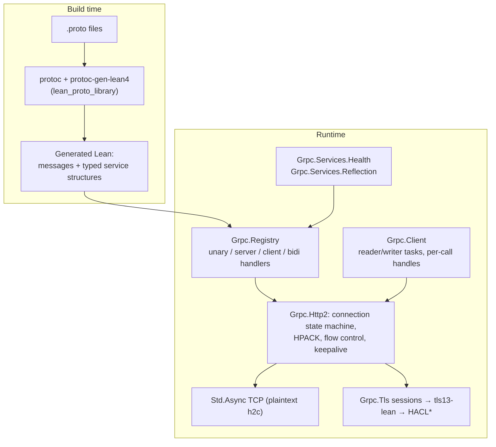

# grpc-lean

[](https://github.com/pb64-lean/grpc-lean/actions/workflows/ci.yml) [](https://github.com/pb64-lean/grpc-lean/actions/workflows/assurance.yml)

Protocol Buffers and gRPC for Lean 4: a pure-Lean gRPC client/server runtime
over HTTP/2, protobuf codegen wired into Bazel, TLS 1.3 termination via the
sibling [`tls13-lean`](https://github.com/pb64-lean/tls13-lean), and health +
reflection services. The Bazel module is named **`rules_lean_grpc`**.

The protocol stack — HTTP/2 framing, HPACK, flow control, gRPC message
framing, metadata, deadlines, cancellation — is implemented in Lean. The only
C in this repository is a small zlib shim for gzip message compression; TLS
cryptography is HACL\* via `tls13-lean`'s C shim.



## Feature surface

| Area | Status |
| --- | --- |
| RPC shapes | Unary, server-streaming, client-streaming, bidirectional — each in a batched (`Array`) and an incremental `MessageStream` variant, with raw-`ByteArray` and typed-codec registration (`registerUnary` … `registerBidirectionalStreamingStreamCodec`) |
| Deadlines | Server-enforced from `grpc-timeout`: expiry cancels the handler task and returns `DEADLINE_EXCEEDED`. The absolute deadline reaches the handler as `request.deadline` (or `context.deadline` via the `register*CodecWithContext` variants for typed handlers), and `CallOptions.propagating` turns what is left of it into a downstream call's `grpc-timeout` — or `DEADLINE_EXCEEDED` when nothing is left. No default deadline: a request without `grpc-timeout` runs unbounded |
| Early authorization | `Registry.withRequestHeaderAuthorizer` runs after header validation and **before any request body is accepted**; rejected streams get a trailers-only status while the body is drained without dispatch |
| Message limits | Per-registry and per-client send/receive caps (`RESOURCE_EXHAUSTED`); 4 MiB default |
| Compression | gzip both directions (see below) |
| Metadata | ASCII + `-bin` base64 binary metadata, full validation (pseudo-header rules, forbidden connection headers, reserved response/trailer names) |
| Health | `grpc.health.v1.Health` `Check` + `Watch`, per-service status, terminal shutdown |
| Reflection | `grpc.reflection.v1` and `v1alpha` `ServerReflectionInfo`; `ListServices` is derived from the registry automatically. `lean_proto_library` codegen embeds each file's serialized `FileDescriptorProto` (source info stripped) as `fileDescriptors`, so `registerWith { files := Generated.fileDescriptors }` answers `FileByFilename`, `FileContainingSymbol`, `FileContainingExtension` and `AllExtensionNumbersOfType` — each response carries the transitive import closure, which is what schema-less clients need to resolve imported messages. Files you do not pass in `Reflection.Config` still answer `NOT_FOUND` |
| Keepalive | Opt-in server PING keepalive with ack timeout (plaintext managed path) |
| Graceful shutdown | `shutdown` sends GOAWAY(NO_ERROR), refuses streams beyond the GOAWAY boundary with `REFUSED_STREAM`, and `wait` drains with a timeout — over both h2c and TLS |
| Connection lifecycle | Every managed plaintext/TLS teardown records one `CloseCause`, with the last 64 readable from `Grpc.Server.closedConnections`. Once HTTP/2 is established and the peer is still readable, teardown makes a best-effort GOAWAY carrying that cause (sealed through TLS); a peer that already closed, or a connection still in TLS handshake, cannot receive one. After shutdown, exact connection owners are observed with a finite bound but never cancelled out from under nested work: timeout leaves the owner and connection registered and returns an ownership error. `acceptFailure?`/`checkAccepting` expose the accept loop while it runs |
| Cancellation | RST_STREAM and peer disconnect cancel in-flight dispatches and take request/response stream callbacks exactly once; each handler and arbitrary callback remains beneath the exact connection owner until it finishes. Handler exceptions become gRPC statuses |
| Error scope | Framing failures are split per RFC 9113 §5.4. Newly invalid DATA on a previously closed stream, HEADERS over `MAX_CONCURRENT_STREAMS`, an open stream exceeding its own receive window, or a PRIORITY frame whose length is not 5 octets (§6.3, FRAME_SIZE_ERROR) answer RST_STREAM while the connection keeps serving. Once a stream has been locally reset, late in-flight DATA is absorbed with connection-only flow credit and no repeat reset, and late field blocks are HPACK-decoded before being discarded. Connection errors — preface violation, CONTINUATION sequencing, stream-id monotonicity, connection-window overflow, or an undecodable field block — still end the connection with GOAWAY. Well-formed deprecated PRIORITY dependency semantics are ignored, including on idle streams; PRIORITY on stream 0 stays connection-fatal. Every connection-scoped check names the RFC rule it follows, and a header refusal is deferred until HPACK has consumed the complete field block |

## Server

```lean
import Grpc

def registry : Grpc.Registry :=
  NoteService.register Grpc.Registry.empty {
    handleEcho := fun request => ...   -- typed handlers, generated per service
    ...
  }

def main : IO Unit := do
  let server ← Grpc.Server.serve registry { address := Grpc.Server.anyIPv4 50051 }
  Grpc.Server.wait server
```

Entry points: `serve` (managed accept loop with connection registry, keepalive,
and shutdown bookkeeping), `serveTls`, `serveForever`/`acceptOne` (unmanaged),
and `serveClient`/`serveClientWithState` for bring-your-own-socket or shared
`Std.Mutex` frame-driver embedding. `Grpc.Server.Config` covers address,
backlog, read size, `TCP_NODELAY`, `maxConcurrentStreams`, `maxHeaderListSize`,
and keepalive interval/timeout. The unmanaged and bring-your-own-socket entry
points return `Std.Async.Async`; spawn them with `Async.toIO` when crossing into
an `IO` lifecycle. Likewise, all in-flight client call and stream operations
run in `Async`, including bounded cooperative `Client.close`; connection setup
and explicit `Async.block` boundaries stay in `IO`.

A managed connection never dies without a local record. Every teardown path records a
`CloseCause` — peer close, server shutdown, keepalive timeout, connection error,
or a failure of the connection task itself. If HTTP/2 has started and the peer
has not already gone, teardown makes a best-effort GOAWAY whose debug data is
that cause before transport retirement. Peer-initiated EOF and failures during
the TLS handshake cannot be announced with an HTTP/2 frame. Locally the last 64 causes are readable from
`Grpc.Server.closedConnections`. `Grpc.Server.acceptFailure?` /
`checkAccepting` expose the accept loop while the server runs, so a dead accept
loop is a reportable failure instead of clients hanging on connect.

`Grpc.Server.wait` is bounded by its finite drain timeout only after
`Grpc.Server.shutdown`; before shutdown it is intentionally the serving
process's blocking join. Nested handler and `MessageStream.cancel` work is
retained by the exact connection task. If arbitrary user code ignores
cancellation, finite post-shutdown `wait` returns an ownership-timeout error
with that task and its `ActiveConnection` still visible rather than orphaning
it. A later wait can complete if the user work eventually returns.

Every teardown then attempts to retire the local socket in `Async`, including after peer
EOF (which is only a read-side half-close). The plaintext/TLS writer drain and
write-side shutdown are each raced against a short timer: a peer that has
stopped reading cannot stall teardown, and no worker thread is parked. When the
shutdown timer wins, `Async.race` leaves that native promise running, holding no
worker, and the file descriptor is released by finalization only when
`uv_shutdown` eventually settles. A TLS server handshake send uses the same
bounded ownership rule: its TLS continuation ends on shutdown, but the
uncancellable native send promise can remain. Lean 4.31's
`Std.Internal.UV.TCP.Socket` offers `shutdown` but no `close`, so prompt FIN is
best-effort. A timed-out `uv_shutdown` can retain descriptor ownership until it
settles. Deterministic descriptor release at the teardown point is outside the
available transport contract because it requires `uv_close`.

A complete server (all four RPC shapes plus reflection) is
`examples/lean_proto/NoteServer.lean`:

```sh
bazel run //examples/lean_proto:note_server -- 50051
```

## Client

`Grpc.Client.connect` / `connectTls` return a `Connection` multiplexing calls
over one HTTP/2 connection (background reader + writer tasks). On top of it:

- `Client.call` — unary; `Client.serverStreaming`; `Client.callRaw` — batched
  any-shape;
- `Client.start` returning a `Call` handle with `send`, `closeSend`, `recv?`,
  `finish`, `cancel` — this covers all four shapes incrementally.

`CallOptions` carry request metadata and a raw `grpc-timeout` value (e.g.
`"5S"`); `CallOptions.withTimeout` sets it from a `Timeout`, and
`CallOptions.propagating request.deadline` sets it to the time left on the
deadline of the request a handler is currently serving. The client advertises `grpc-accept-encoding: identity,gzip` and
transparently inflates gzip responses; it never compresses requests.
`Test/ClientTest.lean` and `Test/StreamingTest.lean` are the reference usage.
`Client.close` cooperatively joins the exact reader/writer owners with bounds.
A plaintext writer failure has its own sticky signal, so it wakes a reader even
when the peer keeps its write side open; that reader marks calls failed and
retires the transport. As on the server, the available TCP primitive is bounded
write-side `shutdown`, not hard `uv_close`: a losing shutdown promise may remain
suspended without a worker until the OS settles it.

## Codegen

```starlark
load("@rules_proto//proto:defs.bzl", "proto_library")
load("@rules_lean_grpc//:defs.bzl", "lean_proto_library")

proto_library(name = "note_proto", srcs = ["note.proto"])
lean_proto_library(
    name = "note_lean_proto",
    proto = ":note_proto",
    module_prefix = "LeanProtoExample",   # Lean namespace for generated code
)
```

`lean_proto_library` runs `protoc` with the vendored
`protoc-gen-lean4` plugin (`third_party/Lean-zh/protobuf`, which also provides
the Lean protobuf runtime) and compiles the result with `rules_lean`. For each
proto3 `service` it generates a structure of typed handlers plus a
`register : Grpc.Registry → Service → Grpc.Registry`; cross-file imports are
wired with `proto_deps`. Only Lean is emitted — no C++ adapter code.

## HTTP/2 and HPACK scope

Implemented and tested:

- Connection preface, SETTINGS exchange and ACK, PING/ACK, WINDOW_UPDATE,
  RST_STREAM, CONTINUATION sequencing (header blocks capped at 1 MiB), DATA
  padding and HEADERS priority-prefix stripping, stream-id validity and
  monotonicity, `MAX_CONCURRENT_STREAMS` enforcement on inbound streams.
- Flow control in both directions at both connection and stream level.
  Streaming request bodies use credit-on-consume: stream window credit is
  granted as the handler consumes messages, giving real backpressure; the
  advertised 4 MiB initial stream window guarantees one maximum-size message
  always fits. Outbound buffering above 4 MiB fails the RPC with
  `RESOURCE_EXHAUSTED`.
- HPACK with the full RFC 7541 static table, dynamic table with eviction and
  size-update handling, Huffman encoding and decoding;
  `authorization`/`proxy-authorization` are always emitted never-indexed.

Unsupported or intentionally ignored:

- `PUSH_PROMISE` is rejected (`UNIMPLEMENTED`); the client fails the
  connection if a server pushes.
- `PRIORITY` frames are parsed, validated, and ignored — no priority tree.
- Inbound GOAWAY is ignored by the server (the client honors it and fails
  affected calls with `UNAVAILABLE`).
- Peer `MAX_CONCURRENT_STREAMS` / `MAX_HEADER_LIST_SIZE` settings are
  accepted but not enforced against outbound work.
- Connection-scoped malformed framing answers GOAWAY; stream-scoped failures
  answer RST_STREAM and leave unrelated streams serving (see the table above).
- Cancellation cleanup is owned at connection granularity. A stream reset is
  emitted before user cleanup begins, but a `MessageStream.cancel` callback or
  handler that never returns parks that connection owner; unrelated streams on
  the same connection cannot progress until it returns. This is deliberate
  exact ownership, not per-stream retirement concurrency.
- No HTTP/1.1 → h2c upgrade; plaintext is prior-knowledge h2c only.
- Outbound plaintext and TLS writer channels are unbounded; flow
  control bounds DATA progress, but sustained encoded control/response
  production can still grow those queues.
- Transport retirement cooperatively drains each connection's sole writer,
  bounds that drain and the TCP write-side shutdown, and sends a local FIN even
  after peer EOF when the OS accepts it (peer EOF is only a half-close). There
  is no hard `uv_close`, so a timed-out native send/shutdown and its descriptor
  can outlive the Lean-level owner without occupying a worker.

## Compression

- Requests/responses with `grpc-encoding: gzip` are decompressed before
  dispatch (per message on streaming paths), guarded by a 4 MiB
  decompression-size limit in the zlib C shim. Any other `grpc-encoding`
  value is rejected with `UNIMPLEMENTED`.
- Responses are gzip-compressed per message (≥ 1 KiB) when the client
  advertised gzip; the client itself sends requests uncompressed.
- The dispatch layer (`Registry.dispatch*`) rejects messages that still carry
  the compressed flag with `UNIMPLEMENTED "compressed requests are not
  supported"` — reachable only when driving the registry directly, since the
  HTTP/2 server path decompresses first. A compressed flag without a declared
  encoding is `INTERNAL` per the gRPC spec.

## TLS

`Grpc.Server.serveTls` terminates TLS 1.3 with ALPN `"h2"` given a DER
certificate chain and a raw Ed25519 signing key. `Client.connectTls` validates
the peer chain and hostname against `trustAnchorsPEM` (leaving it `none` skips
validation — test use only). `Grpc.Tls.Rest` additionally provides a minimal
HTTP/1.1 JSON server over the same TLS stack (one request per connection; not
a general HTTP server). Its accept/connection owners and waits are bounded and
tracked like the gRPC server; it has the same unavoidable losing native
send/shutdown promise when a peer stops reading because no hard close exists.
`Grpc.Tls.Rest.connectionFailures` exposes the bounded last 64 non-fatal
connection failures as connection ID, lifecycle stage, and message.

The server negotiates a single suite — TLS_CHACHA20_POLY1305_SHA256, X25519
(P-256 only when configured), Ed25519 — but selects it from the client's
offered overlap per RFC 8446, so mainstream clients interoperate:
`//examples/lean_proto:note_grpcurl_tls_interop_test` completes real
handshakes with **grpcurl** (Go `crypto/tls`) and **OpenSSL `s_client`**,
negotiating ALPN `h2` and running gRPC over the result (see
[Interoperability status](#interoperability-status)).

TLS limitations:

- One suite, one group, one signature algorithm: a client that offers none of
  them (for example an FIPS-restricted or TLS 1.2-only client) gets a
  handshake failure rather than a fallback.
- Server-initiated keepalive PINGs are plaintext-only. The TLS accept path does
  not schedule `keepaliveIntervalMs`, because its PING would have to be sealed
  through the session. Cause-carrying teardown, connection registration and
  the graceful-shutdown drain apply to TLS.

## Interoperability status

The validation contract does not include the official gRPC interop suite or an
h2spec conformance run.

- `//examples/lean_proto:note_grpcurl_interop_test` drives the Lean server
  with **grpcurl** (grpc-go) over plaintext h2c: reflection `list`, then
  `describe` and RPC invocation resolved entirely from the server's embedded
  descriptors (no `-proto` or `-import-path` flags), including a message
  defined in an imported file, plus unary calls with enum/map/optional
  fields, `DEADLINE_EXCEEDED` via client deadline, error mapping, a 90 kB
  payload, and server-, client- and bidi-streaming calls. It is tagged
  `manual` and `requires-grpcurl`, so a bare `bazel test //...` skips it; CI
  runs it explicitly with grpcurl on `PATH` on pushes and on the weekly gate.
- `//examples/lean_proto:note_grpcurl_tls_interop_test` drives the same server
  through `Grpc.Server.serveTls` — TLS 1.3 terminated by `../tls13-lean`,
  ALPN `h2`, HTTP/2 and gRPC by this repo — with **grpcurl** and **OpenSSL
  `s_client`**. It asserts `ALPN protocol: h2` and chain verification at the
  TLS layer (so a gRPC failure could not be mistaken for a TLS one), that a
  wrong `-servername` is rejected, then repeats the reflection-only
  `list`/`describe`/invoke flow, error mapping, a 90 kB payload that spans
  many 16 kB TLS records, and server-, client- and bidi-streaming over one
  encrypted connection. It is also `manual` and `requires-grpcurl`; CI runs it
  explicitly with grpcurl and openssl on pushes and on the weekly gate.
- Wire behaviors (trailers-only responses, percent-encoded `grpc-message`,
  `-bin` metadata, status mapping) follow the gRPC over HTTP/2 spec and are
  covered by the in-repo test suite.

## Building and testing

This repo is part of a six-repository ecosystem built with Bazel and sibling
checkouts (Bzlmod `local_path_override ../rules_lean`, `../tls13-lean`):

```sh
for r in rules_lean grpc-lean tls13-lean; do
  git clone "https://github.com/pb64-lean/$r"
done
cd grpc-lean
bazel test //...
```

Prerequisites: Bazel 8.5 (`.bazelversion`) and **Nix** — the Lean toolchain
(4.31.0-pre, pinned by `third_party/Lean-zh/protobuf/nixpkgs.{nix,json}`) is
built by Nix. `lakefile.lean` is an IDE/LSP project model only; `lake build`
is not a supported build. Run `tools/link-lean-nix-toolchain.sh` once to give
your editor the same nix-built Lean that Bazel uses.

`bazel test //...` runs the hermetic suite: the ~69-case runtime test
(protocol validation, all four dispatch shapes, HTTP/2 frame codecs, flow
control, live h2c loopback servers), plus dedicated HPACK, hardening
(padding/CONTINUATION/keepalive/crash paths), early-authentication, client,
streaming (including an 80-connection stress case), connection-lifecycle
(cause-carrying GOAWAY before teardown, over both h2c and a real TLS 1.3
session), server-ownership, health, zlib, TLS
handshake, gRPC-over-TLS, REST-over-TLS, and generated-code tests, and the two
`lean_assurance_test` audits below. `examples/grpc_service/` (a standalone module demonstrating a
PostgreSQL-backed service and in-process proof checking of client-supplied
Lean terms) and the vendored `third_party` modules are excluded from `//...`
by `.bazelignore`.

## Assurance and trusted boundary

No end-to-end formal-verification claim is made for this repository: nothing
is proved about the socket-facing I/O, concurrency, or the server loop.

Everything claimed below is checked mechanically, not by review. `bazel test
//:grpc_assurance` audits the compiled `Environment` while the test binary is
compiled: each principal theorem named in that target must exist, be a theorem,
and close over no axiom outside `propext`, `Classical.choice`, `Quot.sound`; no
constant under `Grpc.*` or `Zlib.*` may reach `sorryAx`; and `@[extern]` may
appear only in `Zlib.Gzip`. **No non-standard axiom is allowed and none is
used**: no proof here uses `bv_decide`, so unlike some sibling repositories
there is no generated LRAT-certificate axiom (`…._native.bv_decide.ax_1_5`) in
the allowed set — a proof that introduced one would fail the audit.
`//:grpc_tls_assurance` makes the same `@[extern]` statement about `Grpc.Tls.*`.

Verified scope:

- **Lean protocol code** (HTTP/2, HPACK, gRPC framing, metadata, dispatch):
  implemented in Lean; the I/O paths, dispatch and concurrency are evidenced
  by the test suite described above.
- **Kernel-checked laws over the pure codecs and registry** (no `sorry`,
  no `native_decide`), covering a defined but incomplete set of properties:
  - `Grpc.Framing` — message-frame encode/decode inversion with residual
    bytes (`decodeAll_encode_append`), and that a successful size-limited
    decode never yields an oversized message (`decodeAllWithLimit_size_le`);
  - `Grpc.Http2.Frame` — frame header and whole-frame inversion with
    residual bytes (`decodeHeader_encodeHeader_append`,
    `decodeAll_encode_append`);
  - `Grpc.Http2.Hpack` — integer roundtrip (`decodeInteger_encodeInteger`),
    literal-string roundtrip in both representations
    (`decodeString_encodeString`), the Huffman coder roundtrip
    (`decodeHuffman_encodeHuffman`, resting on prefix-freeness of the
    257-entry table, `huffmanPrefixFree`), and the dynamic-table size
    invariant (`dynamicSize_*_le`);
  - `Grpc.Protocol` — `grpc-timeout` render/parse (`Timeout.parse?_render`),
    including every duration a propagated deadline can produce
    (`Timeout.ofNanoseconds_bounds`, `Timeout.parse?_render_ofNanoseconds`),
    and `grpc-message` percent-coding (`Percent.decode_encode`);
  - `Grpc.Metadata` — base64 roundtrips behind `-bin` metadata
    (`Base64.decodeBytes_encodeBytes`, `…_encodeBytesUnpadded`);
  - `Grpc.Server` — registry well-formedness and lookup uniqueness;
  - `Grpc.Http2.Connection` — rejected streams stay inert;
    `Connection.WellFormed`, the pure connection invariant (client stream-id
    parity and monotone claiming, CONTINUATION sequencing, 31-bit outbound
    window bounds, HPACK tables inside their negotiated limits), holds of
    `initialState` and is preserved by every pure frame transition —
    `prepareHeadersShared_wellFormed`, `appendContinuationFrame_wellFormed`
    and `processNonHeaderFrameShared_wellFormed` (SETTINGS, DATA,
    RST_STREAM, WINDOW_UPDATE, PING, PRIORITY, GOAWAY, unknown), with
    `prepareHeadersShared_no_reopen` (a claimed stream id can never be
    reopened) and `prepareHeadersShared_concurrency`
    (`MAX_CONCURRENT_STREAMS` gates admission: a HEADERS frame either arrives
    below the limit or opens a stream marked for `REFUSED_STREAM`) as
    corollaries; per-stream error containment is
    `processDataShared_inert_reset` — a DATA frame for a stream that has
    already closed produces no request feed, no dispatch, cancels nothing
    outside that stream, emits an RST_STREAM naming only it, and leaves the
    connection serving — together with `rejectStreamAtHeaders_tables` (a
    rejected field block still commits both connection-wide HPACK tables) and
    `resetStreamFlowControl_scoped` (a stream-window overrun preserves
    connection identity and HPACK state, schedules no work, cancels only that
    stream, and emits exactly the connection-credit refund plus its reset);
  - `Grpc.Http2.Connection` flow control — conservation, not just bounds:
    `consumeInboundDataWindow_conserves` (a DATA frame debits both receive
    windows by exactly its payload, and the `Nat` equation witnesses that
    neither subtraction truncated), `processUnaryRequestData_windows` and
    `processActiveRequestData_windows`, `decodeActiveRequestData_conserves`
    plus `takeRequestStreamCredit_conserves` (credit returned on consume
    equals bytes consumed, so the effective window never creeps past the
    advertised one), `flushOutbound_conserves` (bytes put on the wire are
    exactly what the outbound connection window is debited), and
    `defaultStreamWindow_admits_max_message` /
    `inboundWindow_pos_of_incomplete` — the deadlock-freedom argument for
    credit-on-consume.

  Not proved: the HPACK header-block loop, the `IO` halves of the
  HEADERS/CONTINUATION steps (header decoding, authorization, dispatch
  spawning), and everything above the codecs.
- **C in the trusted computing base**: the zlib shim
  (`Zlib/shim/zlib_shim.c`, with an explicit output-size bound) — and nothing
  else first-party, which is what `//:grpc_assurance` confirms by allowing
  `@[extern]` in `Zlib.Gzip` and nowhere else under `Grpc.*`/`Zlib.*` — and,
  via `tls13-lean`, the HACL\* shim. The HACL\* cryptographic primitives
  themselves carry externally machine-verified correctness proofs; the shim
  and `@[extern]` bindings do not.
- **External dependencies**: zlib (Bazel module), the vendored
  [Lean-zh/protobuf](https://github.com/Lean-zh/protobuf) runtime/plugin
  (Apache-2.0, `third_party/Lean-zh/`), and the Lean compiler/runtime.

## License

Apache-2.0. Vendored third-party code retains its own notices under
`third_party/`.
